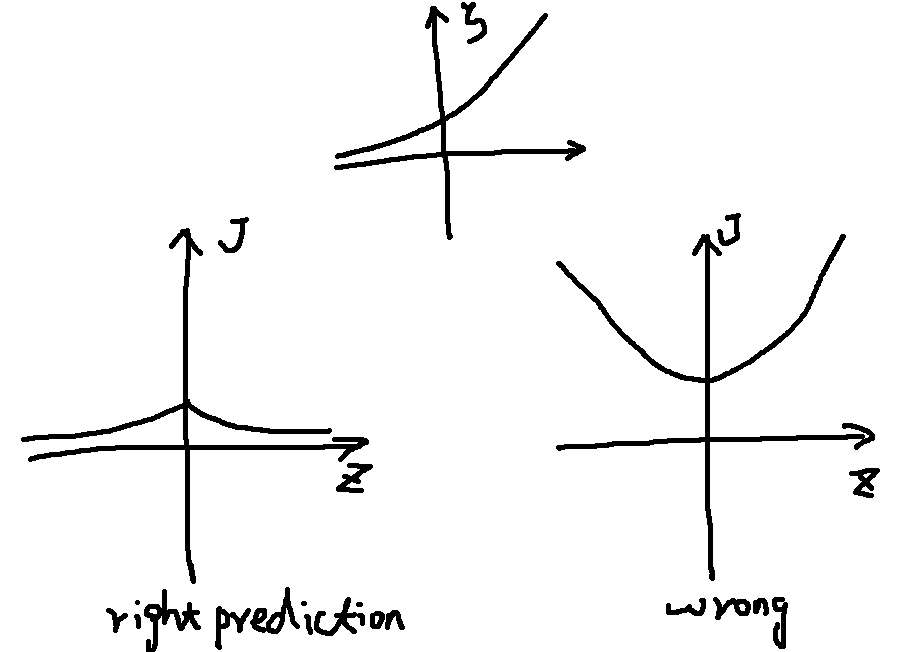
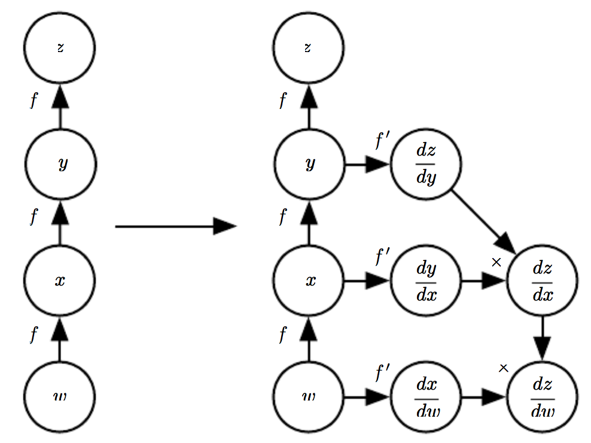
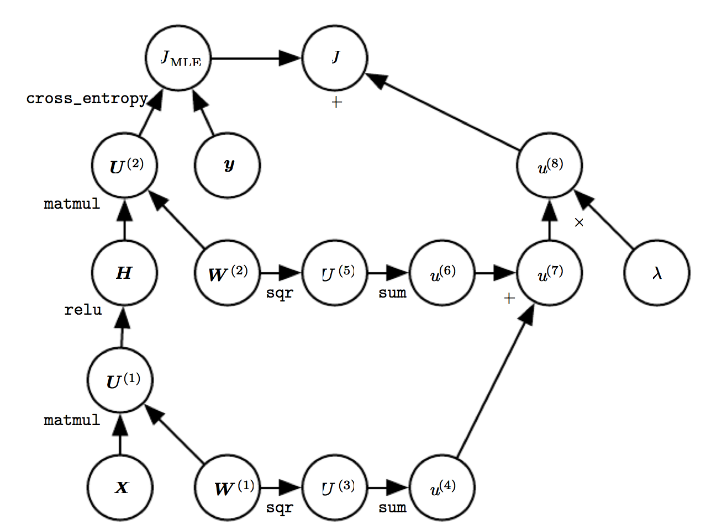

# Chapter 6

## Example: Learning XOR

Model 

$$
f(\Bx;W,c,\Bw,b) = \Bw^T\max\{\mathbf{0}, W^T\Bx+\Bc\} + b.
$$

where

$$
W = \begin{bmatrix}1&1\\1&1\end{bmatrix},\quad c=\begin{bmatrix}0\\-1\end{bmatrix},\quad
\Bw = \begin{bmatrix}1\\-2\end{bmatrix},\quad b=0.
$$

such that

$$
\begin{array}{rcl}
(0,0)^T &\Longrightarrow& 0 \\
(1,0)^T &\Longrightarrow& 1 \\
(0,1)^T &\Longrightarrow& 1 \\
(1,1)^T &\Longrightarrow& 0 
\end{array}
$$

## Gradient-Based Learning

**Neural Network vs. Linear Model**: the nonlinearity of NN leads to non-convex, thus no convergence guarantee for Stochastic Gradient Descent algorithm.

### Cost Functions

  * maximum likelihood: $$p(\By \vert  \Bx;\theta)$$, cross-entropy(data, model)
  * simplification: just predict some statistics of $$\By$$ conditioned on $$\Bx$$
  * regularization: weight decay approach

#### Learning Conditional Distributions with Maximum Likelyhood

Negative log-likelyhood, equivalently the cross-entropy(data,model)

$$
J(\theta) = -\bE_{\Bx,\By\sim\hat p_{data}}\log p_{model}(\By | \Bx).
$$

Example: if $$p_{model}(\By\vert\Bx) = \cN(\By;f(\Bx;\theta),I)$$

$$
	J(\theta) = \frac12\bE_{\Bx,\By\sim\hat p_{data}}\lVert\By-f(\Bx;\theta)\rVert^2 + const.
$$

There is an equivalence between MLE (maximum likelihood estimation) and MSE (mean squared error), so that it is convenient to derive a cost function $$\log p(\By\vert\Bx)$$ from a model $$p(\By\vert\Bx)$$.

Neural network design: the gradient of the cost function must be large and predictable. Saturate/flat cost functions should be avoided. Many output units involve an **exp** function with very negative arguments, $$-\log$$ undoes the effect.

Problem of corss-entropy cost function: no minimum value in practice. Regularization techniques

#### Learning Conditional Statistics

Full probability districution vs. conditional statistics: $$\cN(\By;f(\Bx;\theta),I)$$

**calculus of variations**: view cost function as a functional

$$
f^* = \mathop{argmin}\limits_f\bE_{\Bx,\By\sim p_{data}} \lVert\By-f(\Bx)\rVert^2
$$

yields

$$
f^*(\Bx) = \bE_{\By\sim p_{data}(\By\vert\Bx)}[\By].
$$

Mean absolute error: predicts the __median value__ of $$\By$$ for each $$\Bx$$

$$
f^* = \mathop{argmin}\limits_f\bE_{\Bx,\By\sim p_{data}} \lVert\By-f(\Bx)\rVert_1
$$

Cross-entropy cost function is better than MSE or MAE, although it is not necessary to estimate an entire distribution $$p(\By\vert\Bx)$$.

### Output Units

#### Linear Units for Gaussian Output Distributions

Given features $$\Bh$$, linear output $$\hat\By=W^T\Bh+\Bb$$ is often used to produce the mean of a conditional Gaussian distribution:

$$
p(\By\vert\Bx) = \cN(\By;\hat\By,I).
$$

Maximizing the log-likelihood is then equivalent to minimizing MSE. It is straightforward to learn covariance of the Gaussian, however, the positive definite of cov is difficult to be satisfied.

#### Sigmoid Units for Bernoulli Output Distributions

Binary classification

The following model has gradient of $$\mathbf{0}$$:

$$
P(y=1\vert\Bx) = \max\left\{0,\min\{1,\Bw^T\Bh+b\}\right\}.
$$

Sigmoid units as alternative:

$$
\hat y = \sigma\left(\Bw^T\Bh+b\right), \quad \sigma(z) = \frac{1}{1+e^{-z}}
$$

The distribution

  * unnormalized probability (assumption): $$\log\tilde P(y) = yz \quad \Longrightarrow \tilde P(y)=e^{yz},y\in\{0,1\}$$
  * normalized probability: $$P(y) = \frac{e^{yz}}{e^{0z}+e^{1z}} = \sigma((2y-1)z),y\in\{0,1\}$$
  * variable $$z$$ is called a **logit**
  * loss function $$J$$, softplus $$\zeta$$

$$
J(\theta) = -\log P(y\vert\Bx) = -\log\sigma((2y-1)z) = \zeta((1-2y)z), \quad \zeta(t) = \log(1+e^t).
$$

  * Saturate situation: $$(1-2y)z\to-\infty$$, i.e. $$y=0,z\to-\infty$$ or $$y=1,z\to\infty$$
  * If $$y$$ agrees with $$z$$ and $$\lvert z\vert$$ is large, $$J$$ is saturate
  * If $$y$$ disagrees with $$z$$, $$(1-2y)z=\lvert z\rvert$$, $$J(\theta)=\zeta(\lvert z\rvert)$$
    * Wrong prediction + large $$\lvert z\lvert$$ $$\Longrightarrow$$ large gradient $$\Longrightarrow$$ quick correction

  * Implementation practice: view $$J$$ as a function of $$z$$, rather than $$\hat y=\sigma(z)$$, to avoid $$\log(0)$$

#### Softmax Units for Multinoulli Output Distributions

  * Output $$\hat\By, \hat y_i=P(y=i\vert\Bx)$$ with $$\sum \hat y_i=1$$
  * After predicting an unnormalized log probabilites: $$\Bz=W^T\Bh+\Bb$$ by a linear layer with $$z_i=\log\tilde P(y=i\vert\Bx)$$, we can normalize it as

$$
	softmax(\Bx)_i = \frac{e^{z_i}}{\sum_je^{z_j}}
$$

thus

$$
\log P(y=i;\Bz)=\log softmax(\Bz)_i = z_i-\log\sum_je^{z_j} \approx z_i - \max\{z_j\}
$$

  * If $$\log P(y_i;\Bz)\to0$$, then $$y_i$$ contributes little to overall training cost
  * The final goal is

$$
softmax(\Bz)_i \approx \frac{\sum_{j=1,y^j_i=1}^m 1}{\sum\sum y_i^j}.
$$

  * log-likelyhood works well with softmax, because **log** undo **exp**.
  * Saturate situation for sigmoid: $$\lvert z\rvert$$ is large
  * Saturate situation for softmax: $$\lvert z_i-z_j\rvert$$ is large
  * $$n$$ arguments vs. $$n-1$$ arguments: require $$z_n=0$$
  * Neuroscientific point of view: winner-take-all
  * **softmax**:
    * **soft** means continuous and differentiable
	* **max** means argmax

**** Other Output Types

## Hidden Units

  * Usually adopting a form of
$$
	\Bh = g(\Bz) = g(W^T\Bx+\Bb)
$$

### Rectified Linear Units and Their Generalizations

  * activation function $$g(z) = \max\{0,z\}$$
  * rectified linear units $$\Bh=g(W^T\Bx+\Bb)$$ with small positive $$\Bb_i$$, e.g. $$\Bb=0.1\mathbf{1}$$
  * drawback: inactive when $$z\le0$$
  * generalizations: $$h_i=g(\Bz,\alpha)_i=\max(0,z_i)+\alpha_i\min(0,z_i)$$
    * Absolute value rectification: $$\alpha_i=-1$$ so that $$g(z)=\lvert z\rvert$. used in object recognition
	* Leaky ReLU: $$\alpha_i$$ is small, e.g. 0.01
	* Parametric ReLU (PReLU): $$\alpha_i$$ is a learnable parameter
  * Maxout units: devide $$\Bz$$ to groups, used to learn convex and piecewise linear function
$$
	g(\Bz)_i = \max_{j\in\bG_i}z_j
$$
    * benefits: learn the function itself other than just parameters, require fewer parameters, resist **catastropihc forgetting**

### Logistic Sigmoid and Hyperbolic Tangent

  * logistic: $$g(z)=\sigma(z)=1/(1+e^{-z})$$
  * hyperbolic tangent: $$g(z)=\tanh(z)=2\sigma(2z)-1$$
  * both is discouraged to used in hidden layer
  * hyerbolic tangent works better than logistic, because it resembles the identify function more closely
  * some cases sigmoidal activation functions are prefered: RNN, probabilistic models, autoencoders

### Other Hidden Units

  * active research area, no clear guidance
  * conventional linear hidden units work well
  * softmax/signoid are usually used as output units
  * multiple linear hidden layers: reduce parameters
  * common hidden unit types:
    * Radial basis function (RBF) $$h_i=exp\left(-\frac{1}{\sigma_i^2}\lVert W_{:,i}-\Bx\rVert^2\right)$$. Hard to train
	* Softplus: $$g(a)=\zeta(a)=\log(1+e^a)$$. Generally discouraged
	* Hard tanh: $$g(a)=\max(-1,\min(1,a))$$, similar to tanh and ReLU but bounded

## Architecture Design

  * **architecture**: overall structure of the network, i.e. how many units, how they are connected
  * Usually grouped as chained layers, how to choose depth and width

$$
\Bh^{(i+1)} = g^{(i+1)}\left({W^{(i+1)}}^T\Bh^{(i)}+\Bb^{(i+1)}\right),\quad \Bh^{(0)}=\Bx.
$$

### Universal Approximation Properties and Depth

  * **universal approximation theorem**: a feedforward network with a linear output layer and at least hidden layer with any "squashing" activation function (e.g. logistic sigmoid) can approximate any Borel measurable function between two finite-dimensional spaces with any desired non-zero error, provided there are enough hidden units
  * "no free lunch" theorem: there is no universally superior machine learning algorithm
  * Representation exists, however, learning may fail, and generalization may fail
  * A bound on the size of NN: exponential in the worse cases
  * Shallow network may work, deep network seems better generalization

### Other Architectural Considerations

  * architectures: feedforward, CNN, RNN
  * main chain + skip connection
  * how to connection: full connection, sparse connection

## Back-Propagation and Other Differentiation Algorithms

 * Back-Propagation is used to compute the gradient, and then Stochastic graident descent (SGD) is used to perform learning using this gradient.
 * In learning algorithm, we compute the gradient of cost $$\nabla_\theta J(\theta)$$

### Computational Graphs

### Chain Rule of Calculus

   * Both vectors and tensors are considered as vector
 $$
 \nabla_X z = (\nabla_XY)^T\nabla_Y z = \sum_j(\nabla_X Y_j)\frac{\partial z}{\partial Y_j}
 $$

### Recursively Applying the Chain Rule to Obtain Backprop

### Back-Propagation Computation in Fully-Connected MLP

### Symbol-to-Symbol Derivatives

  * symbol-to-number: Torch, Caffe
  * aditional nodes: Theano, Tensorflow

### General Back-Propagation

  * **op and op.bprop**
    * For example **mul** is $$C=AB$$, **mul.bprop** for $$\nabla_A C$$ is $$g(G)=GB^T$$
  * dynamical programming

### Example: Back-Propagation for MLP Training

$$
X \Longrightarrow H=\max\{0,XW^{(1)}\} \Longrightarrow HW^{(2)} 
$$

$$
J = J_{MLE} + \lambda\left(\lVert W^{(1)}\rVert_2^2 + \lVert W^{(2)}\rVert_2^2\right).
$$

### Complications

  * multiple outputs
  * memory
  * data types
  * undefined gradients
  * real world differentiation

### Differentiation outside the Deep Learning Community

  * automatic differentiaion
  * reverse mode accumulation
  * forward mode accumulation

### Higher-Order Derivatives

  * Hessian matrix: Krylov methods

## Historical Notes

