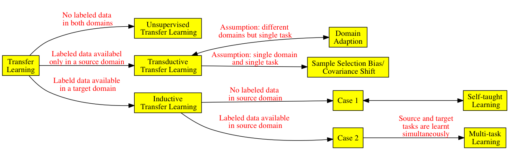

# A Survey of Transfer Learning

  * Author: Sinno Jialin Pan, Qiang Yang
  * Year: 2009
  * Keywords: Transfer Learning, Survey, Machine Learning Data Mining
  * Abstract: 
    * Assumption (training and future data in the same feature space) usually not hold
	* Transfer learning can avoid expensive data labeling efforts
	* This survey focuses on **categorizing** and **reviewing** current progress on transfer learning for **classification**, **regression** and **clustering** problem
	* Transfer learning vs. domain adaption/multi-task learning/sample selection bias/co-variate shift

## Introduction

  * Three examples:
    1. Web document classification: different websites
	2. Indoor WiFi localization: different time periods, different devices
	3. Sentiment classification (Product review): lacking enough labels for some products
  * Focus on classification, regression and clustering, not reinforcement learning

## Overview

### A Brief History of Transfer Learning

  * 1995, NIPS-95 workshop "Learning to learn"
  * Different alias: learning to learn, life-long learning, knowledge transfer, inductive transfer, multi-task learning, knowledge consolidation, context-sensitive learning, knowledge-based inductive bias, meta learning, incremental/cumulative learning
  * Most related: multi-task learning
  * 2005, BAA 05-29 of DARPA's IPTO gave a definition of transfer learning: the ability of a system to recognize and apply knowledge and skills learned in previous tasks to novel tasks
    * transfer learning vs. multi-task learning: one-way vs. bidirection
	* transfer learning vs. traditional learning: knowledge transfer vs. learning from scratch
	* research communities: data mining, machine learning, app of machine learning and data mining

### Notations and Definitions

  * Domain $$\mathcal{D}=\{\mathcal{X}, P(X)\}$$
    * $$\mathcal{X}$$ is a feature space
	* $$P(X)$$ is a marginal probability distribution
	* $$X=\{x_1,\cdots,x_n\}\in\mathcal{X}$$
  * Task $$\mathcal{T}=\{\mathcal{Y},f(\cdot)\}$$
    * trainning data: $$\{(x_i,y_i)\}$$, $$x_i\in X,y_i\in\mathcal{Y}$$
    * $$y=f(x)=P(y\mid x)$$
  * Source Domain $$D_S=\{(x_{S_i},y_{S_i})\}$$, $$x_{S_i}\in\mathcal{X}_S,y_{S_i}\in\mathcal{Y}_S$$
  * Target Domain $$D_T=\{(x_{T_i},y_{T_i})\}$$, $$x_{T_i}\in\mathcal{X}_T,y_{T_i}\in\mathcal{Y}_T$$
  * Some cases:
    1. $$\mathcal{X}_S\neq\mathcal{X}_T$$, $$P(X_S)=P(X_T)$$: e.g. different language, same documents
    2. $$\mathcal{X}_S=\mathcal{X}_T$$, $$P(X_S)\neq P(X_T)$$: e.g. same language, different topics
	3. $$\mathcal{Y}_S\neq\mathcal{Y}_T$$: e.g. binary classification, multi-class classification
	4. $$P(Y_S\mid X_S)\neq P(Y_T\mid X_T)$$: e.g. very unbalanced distribution

### A Categorization of Transfer Learning Techniques

  * main research issue: What/How/When to transfer
    * What: transfer which part of knowledge, then HOW to transfer
    * When: avoid _negative transfer_ for unrelated domains
  * categorization: inductive/transductive/unsupervised transfer learning
    * inductive transfer learning: target task $$\neq$$ source task
	  * a lot of labels in source domain, similar to multi-task learning
	  * no labels in source domain, similar to self-taught learning
	* transductive transfer learning: same task, different domains. No labels in target domain, a lot of labels in source domain
	  * $$\mathcal{X}_S\neq\mathcal{X}_T$$
	  * $$\mathcal{X}_S=\mathcal{X}_T, P(X_S)\neq P(X_T)$$, similar to domain adaption, sample selection and co-variate shift
    * unsupervised transfer learning: similar to inductive transfer learning, but no labels in both domains

<table>
<caption>Various Transfer Learning Settings</caption>
<tr>
	<th colspan="2">Learning Settings</th>
	<th>Source and Target Domains</th>
	<th>Source and Target Tasks</th>
</tr>
<tr>
	<td colspan="2">Traditional ML</td>
	<td>same</td>
	<td>same</td>
</tr>
<tr>
	<td rowspan="3">Transfer Learning</td>
	<td class="noborder">Inductive</td>
	<td>same</td>
	<td>different but related</td>
</tr>
<tr>
	<td class="noborder">Unsupervised</td>
	<td>different but related</td>
	<td>different but related</td>
</tr>
<tr>
	<td>Transductive</td>
	<td>different but related</td>
	<td>same</td>
</tr>
</table>

<table>
<caption>Different Settings of Transfer Learning</caption>
<tr>
	<th>Transfer Learning Settings</th>
	<th>Related Areas</th>
	<th>Source Domain Labels</th>
	<th>Target Domain Labels</th>
	<th>Tasks</th>
</tr>
<tr>
	<td rowspan="2">Inductive</td>
	<td>Multi-task Learning</td>
	<td>Available</td>
	<td>Available</td>
	<td rowspan="3">Regression Classification</td>
</tr>
<tr>
	<td>Self-taught Learning</td>
	<td>Unavailable</td>
	<td>Available</td>
</tr>
<tr>
	<td>Transductive</td>
	<td>Domain Adaption, Sample Selection Bias, Co-variate Shift</td>
	<td>Available</td>
	<td>Unavailable</td>
</tr>
<tr>
	<td>Unsupervised</td>
	<td></td>
	<td>Unavailable</td>
	<td>Unavailable</td>
	<td>Clustering Dimensionality Reduction</td>
</tr>
</table>

Table: Different Approaches to Transfer Learning

| Transfer Learning Approaches | Brief Description |
|:----------------------------:|:------------------|
| Instance-transfer | To re-weight some labeled data in the source domain for use in the target domain |
| Feature-representation-transfer | Find a "good" feature representation that reduces diff(src, target domain) and err(classification, regression) | 
| Parameter-transfer | Discover shared parameters or priors between src and target domain models |
| Relational-knowledge-transfer | Build mapping of relational knowledge between src and target domain. Both domains are relational domains and i.i.d assumption is relaxed in each domain |

Table: Different Approaches Used in Different Settings

| | Inductive | Transductive | Unsupervised |
|:--:|:--:|:---------------------:|:------------:|
| Instance-transfer | X | X | |
| Feature-repr-transfer | X | X | X |
| Parameter-transfer | X | | |
| Rel-knowledge-transfer | X | | |

## Inductive Transfer Learning

**Definition** (Inductinve Transfer Learning) Given a source Domain $$\mathcal{D}_S$$ and a learning task $$\mathcal{T}_S$$, a target domain $$\mathcal{D}_T$$ and a learning task $$\mathcal{T}_T$$, inductive transfer learning aims to help improve the learning of the target predictive function $$f_T(\cdot)$$ in $$\mathcal{D}_T$$ using the knowledge in $$\mathcal{D}_S$$ and $$\mathcal{T}_S$$, where $$\mathcal{T}_S\neq\mathcal{T}_T$$.

### Transferring Knowledge of Instances

  * TrAdaBoost: source and target domains have the same features and labels, only differ in distributions. Re-weight to encourage "good" source data, reduce "bad" source data.
  * remove "misleading" training data: based on difference between $$P(y_T\mid x_T)$$ and $$P(y_S\mid x_S)$$.
  * label data in target domain: with the help of source domain
  * source domain data + SVM

### Transferring Knowledge of Feature Representations

### Transferring Knowledge of Parameters

### Transferring Relational Knowledge

## Transductive Transferring Learning

**Definition** (Transductive Transfer Learning) Given $$\mathcal{D}_S$$, $$\mathcal{T}_S$$, $$\mathcal{D}_T$$ and $$\mathcal{T}_T$$, transductive transfer learning aims to improve the learning of the target predictive function $$f_T(\cdot)$$ in $$\mathcal{D}_T$$ using the knowledge in $$\mathcal{D}_S$$ and $$\mathcal{T}_S$$, where $$\mathcal{D}_S\neq\mathcal{D}_T$$ and $$\mathcal{T}_S=\mathcal{T}_T$$. In addition, some unlabeled target domain data must be available at training time.

### Transferring the Knowledge of Instances

### Transferring Knowledge of Feature Representations

## Unsupervised Transfer Learning

**Definition** (Unsupervised Transfer Learning) Given $$\mathcal{D}_S$$, $$\mathcal{T}_S$$, $$\mathcal{D}_T$$ and $$\mathcal{T}_T$$, transductive transfer learning aims to improve the learning of the target predictive function $$f_T(\cdot)$$ in $$\mathcal{D}_T$$ using the knowledge in $$\mathcal{D}_S$$ and $$\mathcal{T}_S$$, where $$\mathcal{T}_S\neq\mathcal{T}_T$$ and $$\mathcal{Y}_S$$ and $$\mathcal{Y}_T$$ are not observable.

## Transfer Bounds and Negative Transfer

## Applications of Transfer Learning

